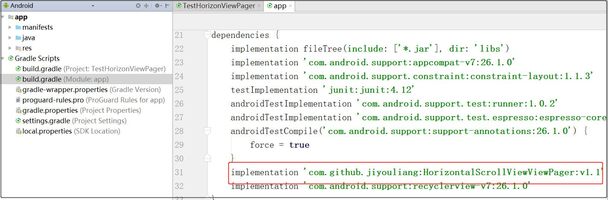

## HorizontalScrollView实现ViewPager

* HorizontalViewPager是一个自定义控件，通过HorizontalScrollView实现ViewPager，解决android默认ViewPager嵌套ListView无法显示问题

### 一、截图

### 二、使用步骤

* 1. 在project的build.gradle添加如下代码（如下图）

			dependencies {
				...
                classpath 'com.github.dcendents:android-maven-gradle-plugin:1.5'
            }

			allprojects {
                repositories {
                    ...
                    maven { url 'https://jitpack.io' }
                }
            }

* 2. 在Module的build.gradle添加依赖（如下图）

			dependencies {
			...
			 'com.github.jiyouliang:HorizontalScrollViewViewPager:v1.1'
			}

* 3. 布局文件中使用HorizontalViewPager
			
			<com.jyl.view.HorizontalViewPager
			        android:id="@+id/viewpager"
			        android:layout_width="match_parent"
			        android:layout_height="wrap_content" />

* 4. 初始化HorizontalViewPager并设置Adapter

			mViewPager = (HorizontalViewPager) findViewById(R.id.viewpager);
			MyAdapter adapter = new MyAdapter(this, mData, mScreenWidth);
        	mViewPager.setAdapter(adapter);
			...

